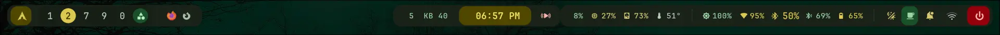
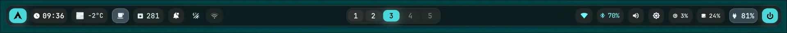
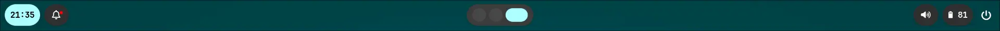
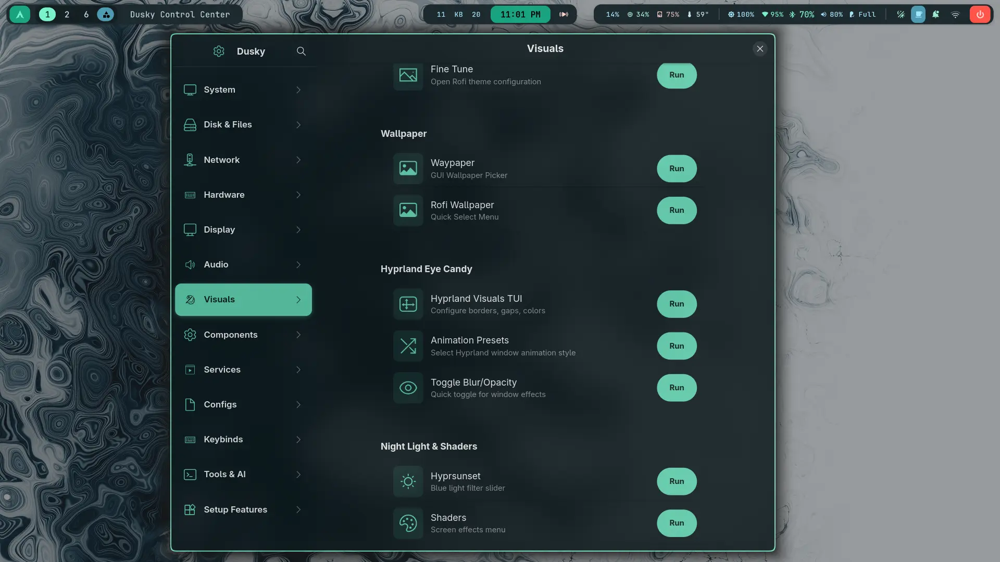

## If you need help with installation or troubleshooting, join the Discord server.


[Join Discord Server][discord]

[discord]: https://discord.gg/Nv2a7yTBQS

## Updated demo video now out on YouTube with all major features covered! 
(since the release of this video around 5 major features have been added, scroll down to the `overview` section for details)

[Watch now][video]

[video]: https://youtu.be/JmgvSdEIK8c

### If you're here just for the wallpapers, you can get all of them (+1050 wallpapers) from my [images repo][images].

[images]: https://github.com/dusklinux/images

### to get this out of the way cuz i'm getting so many questions about waybar. 
YES YOU CAN HAVE HORIZONTAL WAYBAR. and you will be asked which side you want it on bottom/top/left/right. 

- **waybar horizontal and vertical,:**  Take your pick during setup, easily toggleable from rofi as well. 
here's what it looks like. 









### There's also a brand new Dusky Control Center that acts as a system overview gui for settings and features, it's exhaustive in it's scope, almost anything you want to set/change can be done from this one stop shop intuitive gui app. I'll keep adding more quality of life features to it over time.



This repository is the result of 8 months of tinkering/breaking/fixing and polishing. Its a labor of love designed to feel as easy to install as a "standard" distribution but with the raw power and minimalism of arch. **please consider starring ⭐ this repo** as a token of support.

## ⚠️ Prerequisites & Hardware

### Filesystem

This setup is strictly optimized for **BTRFS file system format**. (should also work on ext4 but not recommanded)

- **Why?** ZSTD compression, copy on write (CoW) to prevent data corruption, and you also get instant Snapshots.
    

### Hardware Config (Intel/Nvidia/AMD)

The setup scripts are written to auto detect your hardware and set the appropriate environment variables but in case your hardware is not detected or has some issues, you're advised to configure the following files to set your environment variables.

> [!Note]
>
> Configure the uwsm env files to set your gpu environment variables.
>
> 1. Open the files at ~/.config/uwsm/env and ~/.config/uwsm/env-hyprland
>
> 2. Replace Intel/Nvidia/Amd -specific variables with your hardware equivalents.
>


### Dual Booting

- Compatible with Windows or other Linux distros.

- **Bootloader:** Defaults to `systemd-boot` for UEFI (boots up to 5s faster). Defaults to `GRUB` for BIOS.


# Installation 💿

[Watch Video Tutorial][Watch Video Tutorial]

[Watch Video Tutorial]: https://youtu.be/OzeFAY_8T8Y

**Best for:** Users who already have a fresh, unconfigured Arch Linux installation with Hyprland, set up either via the archinstall script or through a manual install. If you have not installed yet, use the Arch ISO and ensure you select Btrfs as the filesystem and Hyprland as the window manager.

after installing arch, boot into the os and then run this in the terminal. 

### Step 1: Clone Dotfiles (Bare Repo Method)

i use a bare git repository method to drop files exactly where they belong in your home directory.

make sure your connected to the internet and git is installed, 

```
sudo pacman -Syu --needed git
```


clone the repo
```
git clone --bare --depth 1 https://github.com/dusklinux/dusky.git $HOME/dusky
```

deploy the files on your system.

```bash
git --git-dir=$HOME/dusky/ --work-tree=$HOME checkout -f
```

> Note:
> 
> This will immediately list a few errors at the top, but dont worry, that's expected behaviour, the errors will later go away on there own after matugen generates colors and cycles through a wallpaper. 


### Step 2: Run the Orchestra

Run the master script to install dependencies, themes, and services, this will take a while. because it sets up everything. You'll be promted to say yes/no during setup, so dont leave it running unattended.

```bash
~/user_scripts/arch_setup_scripts/ORCHESTRA.sh
```

## The Orchestra Script

The `ORCHESTRA.sh` is a "conductor" that manages ~80 subscripts.

- **Smart:** It detects installed packages and skips them.

- **Safe:** You can re-run it as many times as you like without breaking things.

- **Time:** Expect 30–60 minutes. We use `paru` to install a few AUR packages, and compiling from source takes time. Grab a coffee!


## ⌨️ Usage & Keybinds

The steepest learning curve will be the keybinds. I have designed them to be intuitive, but feel free to change them in the config.

> 💡 Pro Tip:
>
> Press CTRL + SHIFT + SPACE to open the Keybinds Cheatsheet. You can click commands in this menu to run them directly!


It's been tested to work on other arch based distors with hyprland installed (fresh installed) like catchyOS


## 🔧 Troubleshooting

If a script fails (which can happen on a rolling release distro):

1. **Don't Panic.** The scripts are modular. The rest of the system usually installs fine.
    
2. **Check the Output.** Identify which subscript failed (located in `$HOME/user_scripts/setup_scripts/scripts/`).
    
3. **Run Manually.** You can try running that specific subscript individually.
    
4. **AI Help.** Copy the script content and the error message into ChatGPT/Gemini. It can usually pinpoint the exact issue (missing dependency, changed package name, etc.).
    

## overview

Note : i've purposely decided to not use quickshell for anything in the interest of keeping this as light weight as possible, Quickshell can quickly add to ram and slow down your system, therefore everything is user friendly Tui to keep it snappy and lightweight while delivering on A WHOLE HOST OF FEATURES. Read below for most features.

**utilities**

- Music Recognition - allows you to look up what music is playing. 

- Circle to search type feature. uses Google lens. 

- Tui for chaining your hyprland's appearience like gaps, shadow color, blur strength, opacity strength and a lottt more!!

- Ai llm local infrense using ollama side bar (terminal, incredilby resource efficient)

- keybind TUI setter that auto checks for conflicts and unbinds any existing keybind in the default hyrland keybind.conf

- Easily switch Swaync's side to either lift or right.

- airmon wifi script for wifi testing/password cracking
    (only use on access points that you own, i'm not legally responsible if you use it for nefarious purposes)
- live disk i/o monitoring, to allow you to see live read/write disk speed during copying and infer if copying has actually finsihed, useful for flashdrives, external drives. 

- quick audio input/output switch with a keybind, eg if you have bluetooth headphones connected, you can quicly switch to speakers without disconnecting. 

- mono/sterio audio toggling. 

- also supports touchpad gestures for volume/brightess, locking the screen, invoking swaync, pause/play, muting.(requires a laptop or a touchpad for pc)

- battery notifier for laptops, you can customize it to show notifications at certain levels.

- Togglable power saver mode.

- system clean up (cache purge)- removes unwanted files to reclaim storage. 

- usb sounds , get notified when usb devices are plugged/unplugged.

- FTP server auto setup. 

- Tailscale auto setup. 

- Openssh auto setup. with or without tailscale.

- auto warp- cloudflaire setup and toggleale right from rofi. 

- Vnc setup for iphones (wired)

- dynamic frantional scalling script so you can scale your display with a keybind. 

- toggle window transparancy, blur and shadow with a single keybind. 

- hypridle tui configuration.

- wifi connecting script for setup at ~/user_scripts/network_manager/nmcli_wifi.sh

- Sysbench benchmarking script. 

- color picker

- neovim configured, you could also use your own later on. or install lazyvim or any another neovim rice


- github repo integration so you can easily create your own repo to backup all files, this uses bare repo so your specific existing files, listed in ~/.git_dusky_list will backup to github, you can add more files/remove existing ones from this text file.

- btrfs system compression ratio - scans your os files to see how much space zstd compression is saving you. 

- drive manager, easily lock/unlock encrypted drives from the terminal using "unlock media or lock media", it automaticlaly mounts your drives at a specified path, also unmounts when you lock it. This requires you to first configure the ~/user_scripts/drives/drive_manager.sh script with your drives' uuid. 

- ntfs drives have a tendency to not unlock if the drive had previously been disconnected without unmounting first, because of corrupted metadata, i've a script that fixes this. ntfs_fix.sh

RoFI menus. 

- Emoji
- Calculator
- Matugen Theme switcher. 
- Animation switcher. 
- Power menu. 
- Clipboard
- Wallpaper selector
- Shader menu.
- System menu. 

and a lot more that would take forever to list, trust me these dotfiles are the shit! try em out. 

GUI keybind invokable sliders for:
- Volume control 
- Brightness control 
- Nightlight/hyprsunset intensity. 


Speech to text 
- Whisper - for cpu 
or 
- Parakeet - for nvidia gpus. might also work on Amd (not sure)

text to speech 
- kokoro for both cpu and gpu

- mechanical keypress sounds
togglalble with a keybind or from rofi. 

- Wlogout is drawn using a dynamic script that respects your frational scaling. 


**performance and system**

- **light weight**, ~900MB RAM usage and ~5GB disk usage (fully configured).
    
- **ZSTD & ZRAM:** Compression enabled by default to save storage and triple your effective RAM (great for low-spec machines).
    
- **Native Optimization:** AUR helpers configured to build with CPU-native flags (up to 20% performance boost).
    

- **UWSM Environment:** Optimized specifically for Hyprland.
    

**Graphics & Gaming**

- **Fluid Animations:** Tuned physics and momentum for a "liquid" feel, I've spent days fine tuning this.
    
- **GPU Passthrough Guide:** Zero latency (native performance) for dual-GPU setups using Looking Glass.
    
- **Instant Shaders:** Switch visual shaders instantly via Rofi.
    
- **Android Support:** Automated Waydroid installer script.
    

**Usability & Theming**

- **Universal Theming:** `Matugen` powers a unified Light/Dark mode across the system.
    
- **Dual Workflow:** Designed for both GUI-centric (mouse) and Terminal-centric (keyboard) users.
    
- **Accessibility:** Text-to-Speech (TTS) and Speech-to-Text (STT) capabilities (hardware dependent).
    
- **Keybind Cheatsheet:** Press `CTRL` + `SHIFT` + `SPACE` anytime to see your controls.
    


<div align="center">

Enjoy the experience!

If you run into issues, check the detailed Obsidian notes included in the repo (~2MB).

</div>


